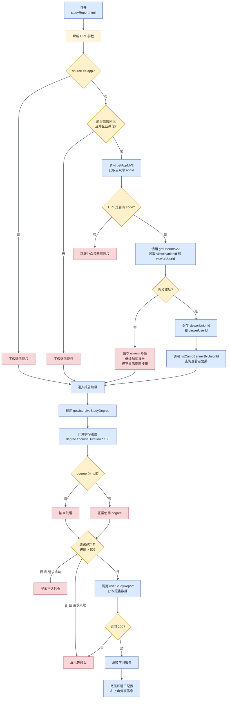

#ODTeam

```mermaid
%%{init: {
  "theme": "base",
  "themeVariables": {
    "fontFamily": "PingFang SC, Microsoft YaHei, sans-serif",
    "fontSize": "14px",
    "edgeLabelBackground": "#ffffff"
  }
}}%%
flowchart TD
    A["打开<br/>studyReport.html"] --> B["解析 URL 参数"]
    B --> C{"source == app?"}

    C -->|"是"| D["不做微信授权"]
    C -->|"否"| E{"是否微信环境<br/>且非企业微信?"}

    E -->|"否"| F["不做微信授权"]
    E -->|"是"| G["调用 getAppIdV2<br/>获取公众号 appId"]
    G --> H{"URL 是否有 code?"}

    H -->|"否"| I["跳转公众号网页授权"]
    H -->|"是"| J["调用 getUserInfoV2<br/>换取 viewerUnionId 和 viewerUserId"]
    J --> K{"授权成功?"}

    K -->|"否"| L["清空 viewer 身份<br/>继续加载报告<br/>但不显示底部按钮"]
    K -->|"是"| M["保存 viewerUnionId<br/>和 viewerUserId"]
    M --> O["调用 listCampBannerByUnionId<br/>查询查看者营期"]

    D --> N["进入报告加载"]
    F --> N
    L --> N
    O --> N

    N --> P["调用 getUserLiveStudyDegree"]
    P --> Q["计算学习进度<br/>degree / courseDuration * 100"]
    Q --> R{"degree 为 null?"}

    R -->|"是"| S["按 0 处理"]
    R -->|"否"| T["正常使用 degree"]

    S --> U{"请求成功且<br/>进度 > 50?"}
    T --> U

    U -->|"否 且 请求成功"| V["展示不达标页"]
    U -->|"否 且 请求失败"| W["展示失败页"]
    U -->|"是"| X["调用 userStudyReport<br/>获取报告数据"]

    X --> Y{"返回 200?"}
    Y -->|"否"| W
    Y -->|"是"| Z["渲染学习报告"]
    Z --> AA["微信环境下配置<br/>右上角分享信息"]

    classDef start fill:#d8f0dc,stroke:#5f8f6b,color:#1f2d1f,stroke-width:1.5px;
    classDef action fill:#dbeafe,stroke:#6c8ebf,color:#1f2937,stroke-width:1.5px;
    classDef decision fill:#fff1cc,stroke:#c9a227,color:#3b2f14,stroke-width:1.5px;
    classDef warn fill:#f8d7da,stroke:#c27b84,color:#4a1f24,stroke-width:1.5px;
    classDef result fill:#e7ddf2,stroke:#8d74b8,color:#2f2347,stroke-width:1.5px;

    class A,N,P,Q,G,J,M,O,X,Z,AA action;
    class C,E,H,K,R,U,Y decision;
    class D,F,I,L,S,T,V,W warn;

    linkStyle default stroke:#57606a,stroke-width:1.5px;

```
